# MERE — Modelo Entidad-Relación Extendido (SQL)

> **Proyecto:** PC-Hospital-MD-Quantify  
> **Motor:** MySQL 8.0+ / SQLAlchemy ORM  
> **API de referencia:** [MEDICAL_REGISTER_API](https://github.com/AngelJdev/MEDICAL_REGISTER_API)  
> **Versión:** 2.0.0

---

## 1. Descripción General

Este documento define el **Modelo Entidad-Relación Extendido (MERE)** del subsistema relacional SQL del proyecto `PC-Hospital-MD-Quantify`. Describe las 12 entidades principales, sus atributos con tipos de dato, cardinalidades de relación, llaves primarias (PK) y llaves foráneas (FK), así como los índices y restricciones de integridad.

El modelo está basado en la arquitectura de `MEDICAL_REGISTER_API` y extendido para soportar el enfoque híbrido SQL + NoSQL del presente proyecto.

---

## 2. Diagrama MERE (Mermaid)

```mermaid
erDiagram

    md_usuarios ||--o{ md_notas_medicas : "crea (medico_id)"
    md_pacientes ||--o{ md_notas_medicas : "tiene (paciente_id)"
    md_pacientes ||--o{ md_signos_vitales : "registra (paciente_id)"
    md_pacientes ||--o{ md_nacimientos : "pertenece (paciente_id)"
    md_pacientes ||--o{ md_defunciones : "pertenece (paciente_id)"
    md_pacientes ||--o{ md_documentos_oficiales : "identifica (paciente_id)"
    md_pacientes ||--o{ md_valoraciones : "evalua (paciente_id)"
    md_notas_medicas ||--o{ md_diagnostico : "genera (nota_id)"
    md_diagnostico ||--o{ md_tratamientos : "prescribe (diagnostico_id)"
    md_domicilios ||--o{ md_personas_tiene_domicilio : "pertenece (domicilio_id)"
    md_pacientes ||--o{ md_personas_tiene_domicilio : "vincula (paciente_id)"

    md_usuarios {
        INT id PK "AUTO_INCREMENT"
        VARCHAR_80 username "NOT NULL, UNIQUE"
        VARCHAR_120 email "NOT NULL, UNIQUE"
        VARCHAR_200 password_hash "NOT NULL (bcrypt)"
        ENUM role "admin | medico | enfermero"
        BOOLEAN activo "DEFAULT TRUE"
        DATETIME created_at "DEFAULT NOW()"
        DATETIME updated_at "ON UPDATE NOW()"
    }

    md_pacientes {
        INT id PK "AUTO_INCREMENT"
        VARCHAR_100 nombre "NOT NULL"
        CHAR_18 curp "NOT NULL, UNIQUE, INDEX"
        DATE fecha_nacimiento
        ENUM sexo "M | F | NB"
        VARCHAR_15 telefono
        DATETIME fecha_registro "NOT NULL"
        DATETIME created_at "DEFAULT NOW()"
    }

    md_notas_medicas {
        INT id PK "AUTO_INCREMENT"
        INT paciente_id FK "-> md_pacientes.id ON DELETE CASCADE"
        INT medico_id FK "-> md_usuarios.id ON DELETE RESTRICT"
        TEXT contenido "NOT NULL"
        ENUM tipo_nota "ingreso | evolucion | egreso | interconsulta | urgencias"
        DATETIME fecha "NOT NULL, INDEX"
        DATETIME created_at "DEFAULT NOW()"
    }

    md_signos_vitales {
        INT id PK "AUTO_INCREMENT"
        INT paciente_id FK "-> md_pacientes.id ON DELETE CASCADE"
        VARCHAR_20 tension_arterial "formato: sist/diast"
        INT frecuencia_cardiaca "lpm"
        DECIMAL_5_2 temperatura "Celsius"
        INT frecuencia_respiratoria "rpm"
        INT saturacion_o2 "porcentaje"
        VARCHAR_30 escala_consciencia
        INT score_mews "calculado por trigger"
        DATETIME fecha "NOT NULL, INDEX"
    }

    md_diagnostico {
        INT id PK "AUTO_INCREMENT"
        INT nota_id FK "-> md_notas_medicas.id ON DELETE CASCADE"
        TEXT descripcion "NOT NULL"
        CHAR_7 codigo_cie "formato CIE-10 (ej. J18.9)"
        ENUM severidad "leve | moderado | grave | critico"
        BOOLEAN activo "DEFAULT TRUE"
    }

    md_tratamientos {
        INT id PK "AUTO_INCREMENT"
        INT diagnostico_id FK "-> md_diagnostico.id ON DELETE CASCADE"
        VARCHAR_200 medicamento "NOT NULL"
        VARCHAR_50 dosis "NOT NULL"
        VARCHAR_50 frecuencia "NOT NULL (ej: cada 8 horas)"
        VARCHAR_30 duracion "NOT NULL (ej: 7 dias)"
        BOOLEAN activo "DEFAULT TRUE"
        DATETIME fecha_inicio
        DATETIME fecha_fin "calculado: inicio + duracion"
    }

    md_nacimientos {
        INT id PK "AUTO_INCREMENT"
        INT paciente_id FK "-> md_pacientes.id ON DELETE RESTRICT"
        DATE fecha_nacimiento "NOT NULL"
        VARCHAR_200 lugar "NOT NULL"
        VARCHAR_100 nombre_madre
        VARCHAR_100 nombre_padre
        DECIMAL_5_2 peso_al_nacer "kg"
        DECIMAL_5_2 talla_al_nacer "cm"
    }

    md_defunciones {
        INT id PK "AUTO_INCREMENT"
        INT paciente_id FK "-> md_pacientes.id ON DELETE RESTRICT"
        DATETIME fecha_defuncion "NOT NULL"
        TEXT causa "NOT NULL (causa inmediata)"
        TEXT causa_basica
        VARCHAR_50 certificador "nombre del medico certificador"
    }

    md_documentos_oficiales {
        INT id PK "AUTO_INCREMENT"
        INT paciente_id FK "-> md_pacientes.id ON DELETE CASCADE"
        ENUM tipo_documento "ine | curp | nss | pasaporte | acta_nacimiento"
        VARCHAR_60 numero_documento "NOT NULL"
        DATE fecha_emision
        DATE fecha_vencimiento
        BOOLEAN vigente "DEFAULT TRUE"
    }

    md_domicilios {
        INT id PK "AUTO_INCREMENT"
        VARCHAR_200 calle "NOT NULL"
        VARCHAR_100 colonia "NOT NULL"
        VARCHAR_100 municipio "NOT NULL, INDEX"
        VARCHAR_60 estado "NOT NULL"
        CHAR_5 cp "NOT NULL"
        DECIMAL_10_7 latitud
        DECIMAL_10_7 longitud
    }

    md_personas_tiene_domicilio {
        INT id PK "AUTO_INCREMENT"
        INT paciente_id FK "-> md_pacientes.id"
        INT domicilio_id FK "-> md_domicilios.id"
        ENUM tipo_domicilio "principal | temporal | referencia"
        BOOLEAN activo "DEFAULT TRUE"
    }

    md_valoraciones {
        INT id PK "AUTO_INCREMENT"
        INT paciente_id FK "-> md_pacientes.id ON DELETE CASCADE"
        VARCHAR_50 escala "NOT NULL (Glasgow | MEWS | APGAR | Braden)"
        VARCHAR_10 resultado "puntaje o clasificacion"
        TEXT observaciones
        DATETIME fecha "NOT NULL, INDEX"
        INT registrado_por FK "-> md_usuarios.id"
    }
```

---

## 3. Descripción de Entidades

### 3.1 `md_usuarios` — Usuarios del Sistema

Gestiona los accesos al sistema clínico. Soporta tres roles con permisos diferenciados:

| Rol | Capacidades |
| :--- | :--- |
| `admin` | CRUD completo, gestión de usuarios, reportes epidemiológicos |
| `medico` | Crear/ver notas, diagnósticos, tratamientos, signos vitales |
| `enfermero` | Registrar signos vitales, ver expedientes (sin modificar) |

**Índices:** `UNIQUE(username)`, `UNIQUE(email)`

---

### 3.2 `md_pacientes` — Pacientes

Entidad central del sistema. Cada paciente es identificado unívocamente por su CURP (Clave Única de Registro de Población — 18 caracteres, formato oficial mexicano).

**Índices:** `UNIQUE INDEX(curp)`, `INDEX(nombre)`  
**Regla de negocio:** Un paciente no puede eliminarse si tiene notas médicas, defunciones o nacimientos asociados (`ON DELETE RESTRICT`).

---

### 3.3 `md_notas_medicas` — Notas Clínicas

Registro del historial clínico por episodio. Cada nota está vinculada a un médico autor y a un paciente.

**Tipos de nota:**
- `ingreso` — Primera nota al ingresar al hospital
- `evolucion` — Seguimiento de la condición
- `egreso` — Alta hospitalaria o transferencia
- `interconsulta` — Solicitada por otro especialista
- `urgencias` — Atención de emergencia

**Índices:** `INDEX(paciente_id, fecha)`, `INDEX(medico_id)`

---

### 3.4 `md_signos_vitales` — Signos Vitales

Registra parámetros fisiológicos medidos en cada toma de enfermería. El campo `score_mews` se calcula automáticamente mediante lógica en la API (o triggers SQL) según los umbrales MEWS.

**Campos calculados:** `score_mews` basado en FC, FR, SpO2, temperatura y nivel de consciencia.

---

### 3.5 `md_diagnostico` — Diagnósticos

Vinculado a una nota médica específica. El campo `codigo_cie` usa la codificación CIE-10 (Clasificación Internacional de Enfermedades, 10ª revisión) con formato alfanumérico (ej. `J18.9` = Neumonía no especificada).

**Restricción:** `codigo_cie` debe seguir el patrón `^[A-Z][0-9]{2}(\.[0-9]{1,2})?$`.

---

### 3.6 `md_tratamientos` — Tratamientos Médicos

Prescripciones asociadas a un diagnóstico. Incluye cálculo automático de `fecha_fin` basado en `fecha_inicio + duracion`.

---

### 3.7 `md_valoraciones` — Escalas de Valoración Clínica

Almacena resultados de escalas clínicas estandarizadas. Para el detalle completo de componentes (ej. apertura ocular, respuesta verbal en Glasgow), se usa la colección MongoDB `valoraciones_flexibles`.

**Escalas soportadas:** Glasgow, MEWS, APGAR (neonatos), Braden (riesgo de úlceras), Norton, SOFA.

---

### 3.8 `md_domicilios` + `md_personas_tiene_domicilio` — Georeferenciación

Tabla intermedia para la relación N:M entre pacientes y domicilios (un paciente puede tener domicilio principal y temporal). Los campos `latitud` y `longitud` permiten análisis epidemiológico geoespacial.

---

## 4. Resumen de Cardinalidades

| Relación | Cardinalidad | Regla |
| :--- | :---: | :--- |
| `md_usuarios` → `md_notas_medicas` | 1:N | Un médico crea muchas notas |
| `md_pacientes` → `md_notas_medicas` | 1:N | Un paciente tiene muchas notas |
| `md_pacientes` → `md_signos_vitales` | 1:N | Un paciente tiene muchas tomas |
| `md_notas_medicas` → `md_diagnostico` | 1:N | Una nota puede tener varios diagnósticos |
| `md_diagnostico` → `md_tratamientos` | 1:N | Un diagnóstico puede tener varios tratamientos |
| `md_pacientes` → `md_valoraciones` | 1:N | Un paciente puede ser valorado múltiples veces |
| `md_pacientes` ↔ `md_domicilios` | N:M | Via `md_personas_tiene_domicilio` |
| `md_pacientes` → `md_nacimientos` | 1:1 | Un paciente tiene un solo registro de nacimiento |
| `md_pacientes` → `md_defunciones` | 1:0..1 | Paciente puede o no tener registro de defunción |

---

## Equipo de Desarrollo

| Colaborador | Rol | Github | Estado |
| :--- | :--- | :--- | :--- |
| **Angel de Jesús** | Tech Lead & Architecture | [@angelJesus13](https://github.com/angelJesus13) | Revisado y Aprobado |
| **Francisco Garcia** | Lead Backend Developer | [@F-Anks](https://github.com/F-Anks) |  Revisado y Aprobado |
| **Farias Leyva** | Frontend & Documentation | [@farias](https://github.com/farias) | Aprobado confirmado |
| **Artiaga Morales** | QA & Data Science | [@artiaga](https://github.com/artiaga) | En Revision |
| **Brian Jesús Mendoza Márquez** | Fullstack Developer | [@BrianMendoza](https://github.com/BrianMendoza) | Aprobado |
