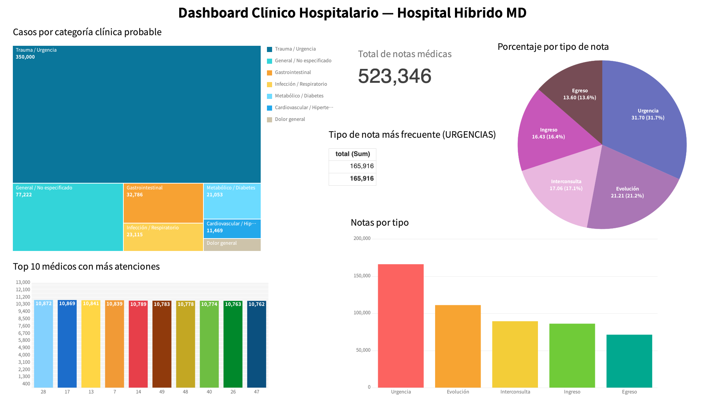

# Dashboard Clinico Hospitalario

## Descripcion general

Esta carpeta contiene la evidencia visual del dashboard desarrollado para el proyecto **Hospital Hibrido MD**, construido a partir de la informacion, estructura y contexto definidos en el [`README` del manual de despliegue](../DeployManual/README.md).

El objetivo de este dashboard es presentar de forma clara los resultados mas relevantes del modulo de registros medicos, permitiendo interpretar rapidamente el comportamiento de las notas clinicas y su distribucion dentro del sistema.

## Vista del dashboard

## Explicacion del trabajo realizado

El dashboard fue elaborado como un recurso de analisis y visualizacion para apoyar la interpretacion de los datos generados por la API y las pruebas de volumen documentadas en el manual de despliegue. Su diseno resume, en una sola vista, indicadores clave del sistema hospitalario, facilitando la lectura de patrones y volumenes de informacion clinica.

Con base en la evidencia mostrada en la imagen, el dashboard integra los siguientes elementos:

- **Total de notas medicas:** muestra un acumulado general de `523,346` registros procesados.
- **Casos por categoria clinica probable:** usa un treemap para visualizar la concentracion de casos por categoria, destacando principalmente `Trauma / Urgencia`, seguida de `General / No especificado`, `Gastrointestinal` e `Infeccion / Respiratorio`.
- **Porcentaje por tipo de nota:** presenta la proporcion de notas como `Urgencia`, `Evolucion`, `Interconsulta`, `Ingreso` y `Egreso`.
- **Tipo de nota mas frecuente:** identifica a `URGENCIAS` como la categoria con mayor volumen, con `165,916` registros.
- **Notas por tipo:** compara visualmente la cantidad total de registros por cada tipo de nota.
- **Top 10 medicos con mas atenciones:** destaca a los medicos con mayor numero de registros atendidos dentro del conjunto de datos analizado.

## Relacion con el Deploy Manual

Este trabajo se apoya directamente en lo documentado en [`../DeployManual/README.md`](../DeployManual/README.md), especialmente en los apartados donde se describe:

- la arquitectura general de la API;
- la separacion entre la API principal y la API de pruebas de volumen;
- el manejo de datos en MySQL y MongoDB;
- el contexto de las pruebas masivas sobre notas medicas.

Gracias a esa base, el dashboard funciona como una representacion visual del comportamiento de los datos hospitalarios generados y analizados durante el despliegue y validacion del sistema.

## Proposito del dashboard

Este entregable ayuda a:

- comunicar resultados de forma visual y comprensible;
- identificar tendencias dentro de las notas medicas;
- detectar categorias o tipos de nota con mayor carga operativa;
- complementar la documentacion tecnica con evidencia grafica del analisis realizado.

## Equipo de Desarrollo

| Colaborador                     | Rol                      | Github                                           | Estado              |
| :------------------------------ | :----------------------- | :----------------------------------------------- | :------------------ |
| **Ángel de Jesús**              | Tech Lead & Architecture | [@angelJesus13](https://github.com/angelJesus13) | Revisado y Aprobado |
| **Francisco García G**          | Lead Backend Developer   | [@F-Anks](https://github.com/F-Anks)             | Revisado y Aprobado |
| **Al Farias Leyva**             | Frontend & Documentation | [@farias](https://github.com/farias)             | Aprobado confirmado |
| **Artiaga Morales**             | QA & Data Science        | [@artiaga](https://github.com/artiaga)           | Completado          |
| **Brian Jesús Mendoza Márquez** | Fullstack Developer      | [@BrianMendoza](https://github.com/BrianMendoza) | Aprobado            |
