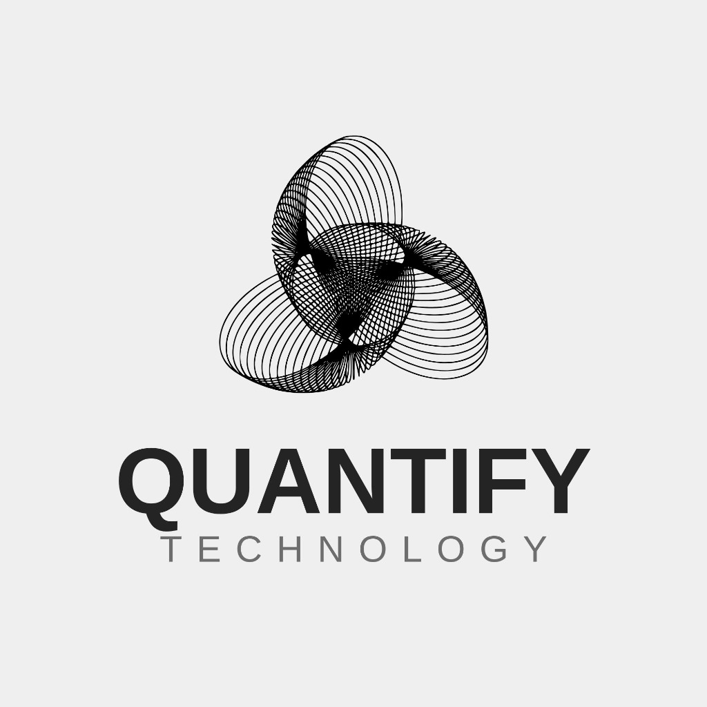
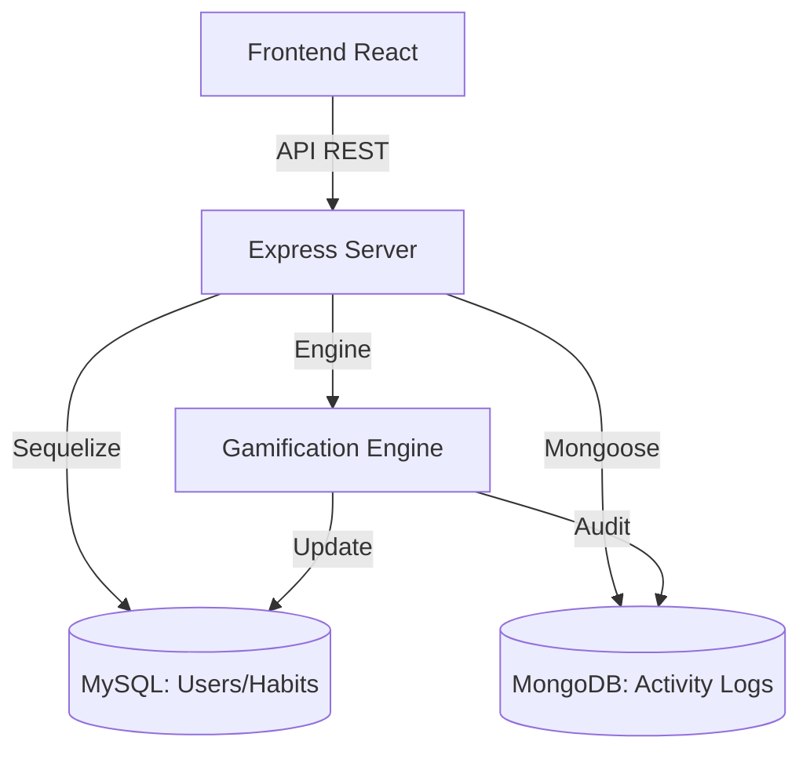

# QUANTIFY - Habit Tracker & Gamification Engine

  

  
  
  

---

### DESCRIPCIÓN
**Quantify** es una plataforma de ingeniería aplicada al bienestar personal. No es solo un rastreador de hábitos; es un motor de gamificación avanzado que utiliza una arquitectura híbrida para monitorear, analizar y premiar la disciplina humana mediante métricas de precisión y algoritmos de racha real.

### PLANTEAMIENTO DEL PROBLEMA
En la actualidad, la mayoría de los habit trackers sufren de "inflación de métricas". Los usuarios pierden la motivación porque el sistema no valida el esfuerzo real o carece de una base de datos sólida para auditorías de salud a largo plazo. Existe una falta de herramientas que integren biometría básica con gamificación de alta fidelidad.

### PROPUESTA DE SOLUCIÓN
Implementar una aplicación de alto rendimiento que separe la gestión operativa de usuarios (SQL) de la analítica de logs masiva (NoSQL). La solución incluye un **Motor de Gamificación** que valida la racha basándose en logs reales de actividad, garantizando que cada logro sea un reflejo veraz de la disciplina del usuario.

### OBJETIVO GENERAL
Desarrollar un ecosistema digital integral que fomente la creación de hábitos mediante un sistema de recompensas dinámico, proporcionando una interfaz premium y una infraestructura de datos escalable para el seguimiento de metas personales.

### OBJETIVOS ESPECÍFICOS
- **Motor de Gamificación de Precisión**: Validar rachas mediante auditoría cruzada en MongoDB.
- **Arquitectura Híbrida**: Utilizar MySQL para integridad transaccional (Usuarios) y MongoDB para logs de alto volumen.
- **Interfaz de Alto Nivel**: Proporcionar una experiencia de usuario (UX) basada en el diseño "Engineering Aesthetic".
- **Sistema de Población de Datos**: Capacidad para inyectar y analizar hasta 300,000 registros para pruebas de estrés.

---

### STACK TECNOLÓGICO

| Capa | Tecnologías |
| :--- | :--- |
| **Frontend** |   |
| **Backend** |   |
| **Bases de Datos** |   |

---

### ARQUITECTURA DEL SISTEMA

---

### ESTRUCTURA DE LA DOCUMENTACIÓN (EL ENCARPETADO)
A continuación se detalla la arquitectura de documentación conceptual del proyecto, facilitando el acceso directo a los READMEs explicativos de cada sección:

*   📂 **PC-Hospital-MD-Quantify/**
    *   📂 **Docs/**
        *   📂 `BRs/` *(Requerimientos de Negocio)* ─── 📄 **[README.md](./Docs/BRs/README.md)**
        *   📂 `FRs/` *(Requerimientos Funcionales)* ─── 📄 **[README.md](./Docs/FRs/README.md)**
        *   📂 `GUIs/` *(Interfaces Gráficas)* ─── 📄 **[README.md](./Docs/GUIs/README.md)**
        *   📂 `NFRs/` *(Requerimientos No Funcionales)* ─── 📄 **[README.md](./Docs/NFRs/README.md)**
        *   📂 `UHs/` *(Historias de Usuario)* ─── 📄 **[README.md](./Docs/UHs/README.md)**
        *   📂 `URs/` *(Requerimientos de Usuario)* ─── 📄 **[README.md](./Docs/URs/README.md)**

---

## Equipo de Desarrollo

| Colaborador | Rol | Github | Estado |
| :--- | :--- | :--- | :--- |
| **Angel de Jesús** | Tech Lead & Architecture | [@angelJesus13](https://github.com/angelJesus13) | Revisado y Aprobado |
| **Francisco Garcia G** | Lead Backend Developer | [@F-Anks](https://github.com/F-Anks) | Completado |
| **Farias Leyva** | Frontend & Documentation | [@farias](https://github.com/farias) | En Revision |
| **Artiaga Morales** | QA & Data Science | [@artiaga](https://github.com/artiaga) | En Revision |
| **Brian Jesús Mendoza Márquez** | Fullstack Developer | [@BrianMendoza](https://github.com/BrianMendoza) | Aprobado |

---

### INSTALACIÓN RÁPIDA
1. Clonar el repositorio.
2. Instalar dependencias en `/backend` y `/frontend` con `npm install`.
3. Configurar el archivo `.env` en el backend.
4. Ejecutar `npm run dev` en ambas carpetas.
